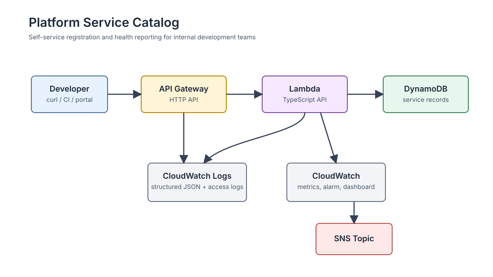
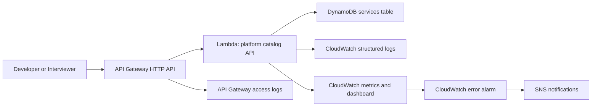

# Platform Service Catalog Challenge

This repo implements a small internal developer platform API for service registration and operational health reporting. The target user is a development team that wants to self-register a service, publish a status update, and retrieve platform-readable service metadata without opening a ticket.

## Architecture





## Tech Stack

- TypeScript, Node.js 22, AWS Lambda
- API Gateway HTTP API
- DynamoDB with point-in-time recovery and server-side encryption
- Terraform modules
- CloudWatch logs, metrics, dashboard, alarm, and SNS topic
- GitHub Actions for CI and manual Terraform deployment

## API

| Method | Path | Description |
| --- | --- | --- |
| `GET` | `/health` | Runtime health probe |
| `POST` | `/services` | Register a service |
| `GET` | `/services` | List registered services |
| `GET` | `/services/{serviceId}` | Get one service |
| `POST` | `/services/{serviceId}/checks` | Publish latest health check |

## Local Development

```bash
cd app
npm ci
npm test
npm run lint
npm run build
```

## Package Lambda

```bash
cd app
npm run package
```

The package command writes `app/function.zip`, which Terraform deploys.

## Deploy

Prerequisites:

- AWS credentials configured for the target account
- Terraform 1.6+
- Node.js 22+

```bash
cd app
npm ci
npm run package

cd ../infra/environments/dev
terraform init
terraform plan -out=tfplan
terraform apply tfplan
```

The `api_endpoint` Terraform output is the base URL for demo commands.

## Demo Commands

```bash
API_URL="https://example.execute-api.us-east-1.amazonaws.com"

curl "$API_URL/health"

curl -X POST "$API_URL/services" \
  -H "content-type: application/json" \
  -d '{
    "name": "payments-api",
    "team": "checkout",
    "environment": "prod",
    "repoUrl": "https://github.com/example/payments-api",
    "healthUrl": "https://payments.example.com/health",
    "tags": ["node", "tier-1"]
  }'

curl "$API_URL/services"

curl -X POST "$API_URL/services/svc_REPLACE_ME/checks" \
  -H "content-type: application/json" \
  -d '{
    "status": "healthy",
    "message": "Deployment completed successfully",
    "version": "1.2.3"
  }'
```

## Observability

The Lambda emits structured JSON logs with request route, status code, duration, request ID, and error metadata. Terraform creates CloudWatch log groups with retention, an error alarm for the Lambda, an SNS topic for notifications, and a simple dashboard for invocations and errors.

## Security

The Lambda role can only read and write the specific DynamoDB table created by this environment. Logs are scoped to the Lambda log group. DynamoDB encryption at rest and point-in-time recovery are enabled. No secrets are required by the current service; sensitive values should be introduced through SSM Parameter Store or Secrets Manager if future integrations need them.

## CI/CD

Pull requests run TypeScript build, lint, tests, Terraform formatting, and Terraform validation. The Terraform deployment workflow is manual with `workflow_dispatch`, which keeps production-changing actions explicit for a take-home repo while still demonstrating deploy automation.

## AI Workflow

`CLAUDE.md` documents the AI agent constraints and review checklist used while building this project. [docs/AI_WORKFLOW.md](docs/AI_WORKFLOW.md) summarizes how AI was used, where the output needed course correction, and what I would improve in the workflow.

## Digging Deeper Option

This submission targets Option 3: Show Off Dev Skills in Your App. The API includes input validation, robust error handling, structured logging, health endpoints, DynamoDB persistence, and deployable AWS infrastructure.
